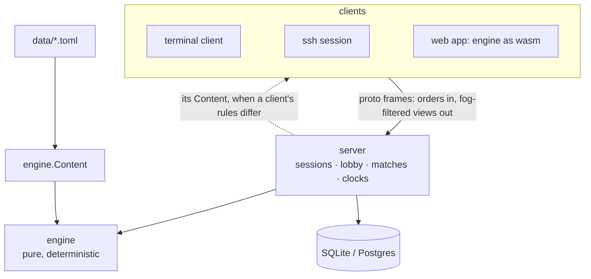
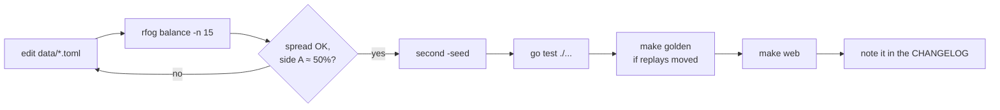

# Contributing to RFoG

RFoG ("RF over Glass") is one Go binary, `rfog`: server, terminal client,
bots and tools, plus a web app (vanilla
JavaScript, with the game engine compiled to WebAssembly) that the binary
serves. Read the house rules below before proposing anything big; the short
version is that every client runs the same engine, the server decides, and
every rule is data.

## Build and test

```
go build ./... && go vet ./... && go test ./...   # all green, every change
go run ./cmd/rfog                                # play
go run ./cmd/rfog serve                          # server: tcp :7777, ssh :2222, web :8080
make cross                                         # static binaries for nine platforms
make wasm                                          # the engine must keep compiling for the browser
make web                                           # rebuild web/engine.wasm after engine, data or webplay changes
```

Go 1.25+ (see `go.mod`), `CGO_ENABLED=0`, no other toolchain.

## How it fits together



| Package | Owns |
|---|---|
| `engine/` | the rules: resolution, fog, validation, replays. Stdlib only. |
| `data/` | every number, hero, unit, ability and map, as TOML |
| `proto/` | the wire format |
| `server/` | authority: matchmaking, clocks, ratings, storage, the TCP/SSH/web listeners |
| `client/`, `render/` | the terminal client: screens, board drawing, themes |
| `web/` | the web app (`index.html`, `play.js`, `play.css`, `engine.wasm`), embedded in the binary |
| `webplay/`, `cmd/wasm/` | the game API the web app drives, compiled to WebAssembly |
| `assets/` | the pixel figures and poses (`units.go`), monochrome portrait frames |
| `bots/` | bot players (also how balance is measured) |
| `tools/balance` | `rfog balance` |
| `tools/portraits` | monochrome portrait frames from a sprite sheet (`go run ./tools/portraits`) |
| `tools/icons.py` | the PNG icons from the logo (see below) |

## Rules of the house

- **Rules are data.** A balance change is a TOML edit, never code. If the data
  can't express a rule, add the mechanic to the engine and the field to `data/`.
- **One engine.** The server, offline play, replays, bots and any future client
  all run `engine/`. Nothing re-implements a rule.
- **The server decides.** Clients send orders and draw what they're told,
  and online they use the server's rules.
- **Fair to both sides.** Maps are 180° symmetric, and the rules must be too.
  `engine/symmetry_test.go` and `tools/balance/symmetry_test.go` guard this.
- **Keyboard first in the terminal.** Every action has a key; mouse and touch
  send the same keys. The web app is touch and mouse first.
- **Words.** They're "bots", never "AI".
- **Minimal dependencies.** Ask before adding one.
- **Show it.** A change you can see (a theme, the board, a screen, the web
  app) comes with screenshots; terminal changes with one at 24-bit colour and
  one at 256 (`rfog -tier t1`).
- **Boards are three colours.** A board theme is its light squares, dark
  squares and walls: one line in `render/boards.go` and the same line in
  `BOARDS` in `web/play.js`. Everything else is derived. The figures are
  dark silhouettes, so `TestBoardsReadable` holds every board to fibre's
  contrast and keeps its colours apart at 256 colours; `web/boards_test.go`
  keeps the two lists equal.

## Changing balance



Change one number at a time. If a hero is off because the bot plays it badly,
fix the bot, not the hero.

## Testing

Tests drive the real thing headlessly: terminal screens by key presses
(`client/match_test.go`), two clients against an in-process server
(`client/online_test.go`), protocol-level clients (`server/server_test.go`,
`server/account_test.go`), the web app's transport over a real WebSocket
(`server/gateway/net_test.go`), the web app's game API (`webplay/`), and a
matrix of screen sizes (`client/layout_test.go`). The web app's own page
code has no browser tests; its engine calls can be exercised from Node with
`web/wasm_exec.js`. A bug fix comes with the test that failed before it.

## Docs

- A change players can see updates [`MANUAL.md`](MANUAL.md) and gets a line
  in [`CHANGELOG.md`](../CHANGELOG.md).
- The README stays a front page: what RFoG is, how to play, how to host.

## Donations

The web app has a Support section and a Donate link that appear when
`DONATE_URL` at the top of the preferences code in `web/play.js` is set
(empty by default). Point it at the project's donation page.

## Logo and icons

`web/icon.svg` is the mark and the favicon. The PNG icons (favicon, home
screen, app manifest) are rendered from the same geometry by
`python3 tools/icons.py web /tmp/preview.png` (needs Pillow); edit the
SVG and the script together.
