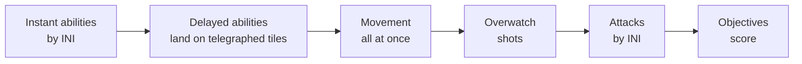

# How to play RFoG

Two sides plan their turn in secret, then the turn resolves for both at
once. Nobody wins on reflexes or ping: you win by reading what the other
side is about to do.

RFoG is the same game in a **web app** and a **terminal**. This manual covers
both; where they differ, it says so.

```
 T01/12  ORDERS   * 0-0   you vs bot BRAM
+-------------------------------------------+
|     a    b    c    d    e    f    g    h  |
| 1  .    .    .    %                       |
| 2  .    U    #    *                       |
| 3  .    L    -    -    -    -             |
| 4  .   >V <  -    *2   *2                 |
| 5  .    R    -    *2   *2                 |
| 6  .    M    -    -    -    -             |
| 7  .    .    .    .    *    #             |
| 8  .    .    .    .    %    .             |
+-------------------------------------------+
```

**Reading the board.** In the web app every unit is a pixel figure: your
side's eyes and lights glow cyan, the enemy's orange, and a bar under each
shows its health. Objectives are outlined zones that light up for whoever
holds them; walls are dark blocks; high ground is raised plating; fogged
squares, where you can't see, are dimmed.

The terminal draws the same figures on big tiles in colour. In its plain
text mode (above) capital letters are your units and lowercase the enemy's
(`V` here is your commander), `*` is an objective, `#` a wall, `%` cover and
`-` high ground; a digit after a glyph is the tile's height, and blank tiles
are fogged. `T01/12` is the turn and `0-0` the score.

## Start

**Web app:** open the server's address and play: nothing asks you to sign
in first. Tap a clock in the quick pairing grid for a casual game online,
**Play against bots** (right column) for a commander and a bot level, or
**Pass and play** for two players at one device (each plans in turn while
the other looks away, then the turn plays out for both). **Watch** in the
top bar lists the matches between players being played now, by clock; tap
one to watch it live. **Learn** has the rules, every commander, and a
tutorial match with a coach.
**Sign in** (top right) to play rated.

**Terminal:**

```
./rfog            # home: quick pairing, vs bots, pass and play, challenge, watch, replays, settings
./rfog bots       # straight into a match against bots
```

On a big terminal the home screen has the web app's top bar: **Watch**
(`w`), **Learn** (the commanders) and **Leaderboard** (`L`); up from the
clocks reaches it. Back (`esc`) from an online screen returns to this home
screen; on a small terminal, to the online menu.

New here? The terminal's **how to play** (tutorial) is a guided match, and the web
app's **Learn** page explains a turn in a minute.

## A turn

Each unit gets one order per turn. Your commander gets two, for example a
move and an ability. Give your orders, then commit: **End turn** in the web
app, `space` in the terminal. When both sides have committed, the turn
resolves in this order:



- **Initiative (INI)** decides who acts first. If two units move to the same
  tile, the higher INI gets it. If they tie, both stop short.
- **Attacks** roll one six-sided die per point of ATK. Each die that meets or
  beats the target's DEF is a hit, and each hit does 1 damage. Cover (against
  attackers that aren't adjacent) and holding make you harder to hit. Shooting
  from higher ground adds a tile of range.
- **Telegraphs.** A delayed ability marks its tiles a turn before it lands,
  so move off any tile marked for you.
- **Overwatch.** A unit on overwatch doesn't attack. Instead it fires at the
  first enemy that moves through its range.

## Winning

At the end of each turn, the side holding more objectives scores the
difference. If both sides hold the same number, nobody scores, so you have
to take the middle. Killing an enemy commander is worth 2 points. The first
side to 5 points wins; otherwise the higher score after 12 turns wins, and
if scores are level, the side with more kills; otherwise it's a draw. A dead commander comes back
after a few turns.

Your commander levels up from kills, and from objectives that score while
it, or a unit next to it, holds them. Abilities `q` and `w` are available from the start, `e` unlocks at
level 2 and `r` at level 4. At level 3, every cooldown drops by one turn.

## Giving orders in the web app

Tap one of your units: dots show where it can move, red rings what it can
attack (with the dice and the number each must roll). Tap a dot to move
there, a ring to attack, or drag the unit onto a square. A commander stays
selected after its first order, so you can move and then attack from there.
**Abilities** opens the selected unit's abilities; **Hold** and **Watch**
(overwatch) are one tap; **Undo** takes back the last order. A faded copy of
a unit marks where it is going. Tap the board during a turn's playback to
skip it.

## Keys (terminal)

The keyboard is the real interface. Mouse and touch send the same keys and
are never required.

| Key | Does |
|---|---|
| `hjkl` `yubn` / arrows | move the cursor · `HJKL` scroll the board |
| `tab` | next unit |
| `enter` | select a unit / confirm a target |
| `m` · `a` | move · attack |
| `q` `w` `e` `r` | commander abilities |
| `1`–`4` | unit abilities (the medic's heal and smoke) |
| `o` · `x` | overwatch · hold (+DEF until you move) |
| `d` | drop that unit's orders |
| `space` | commit the turn |
| `esc` | cancel |
| `i` | unit and tile details (small screens) |
| `:` | command line: `m l d7` move the lineman to d7 · `c q g5` cast q at g5 · `commit` |
| `.` | skip the animation |
| `t` | chat (online) |
| `g` | the log and chat, full screen |
| `?` | these keys, in game |
| `Q` `Q` | quit to menu; the first `Q` asks, and leaving forfeits a timed online match |

## Commanders

Every player gets a commander plus a lineman, a ranged unit, a runner and a
medic. (In the experimental team modes each player gets fewer units.)

<details>
<summary><b>HASK</b>, Breaker: melee frontline</summary>

HP 11 · MV 5 · JMP 2 · RNG 2 · ATK 4 · DEF 4 · INI 4

- `q` **Lunge**: jump up to 3 tiles to an enemy and strike it
- `w` **Brace**: shield 3 for 2 turns
- `e` **Crack**: 2 damage and a push of 2
- `r` **Breach**: next turn, 3 damage and a push to everything around you
</details>

<details>
<summary><b>WREN</b>, Marksman: ranged damage</summary>

HP 9 · MV 4 · JMP 1 · RNG 2 · ATK 3 · DEF 5 · INI 4 · VIS 7

- `q` **Tag**: mark an enemy; attacks on it roll 2 extra dice for 2 turns
- `w` **Relocate**: teleport up to 4 tiles
- `e` **Long Shot**: next turn, 4 damage on a tile up to 9 away (it hits anyone there)
- `r` **Overwatch Net**: 3 overwatch shots at range 9
</details>

<details>
<summary><b>NUL</b>, Operator: area control</summary>

HP 9 · MV 4 · JMP 1 · RNG 2 · ATK 2 · DEF 5 · INI 4

- `q` **Static Field**: next turn, slow and reveal enemies in a 3x3 area
- `w` **Cut Line**: root an enemy for a turn
- `e` **Whiteout**: next turn, smoke that blocks sight for 2 turns
- `r` **Blackout**: in two turns, silence everything in a 5x5 area and cut its INI
</details>

<details>
<summary><b>MOTT</b>, Signaler: support and tempo</summary>

HP 10 · MV 5 · JMP 2 · RNG 3 · ATK 2 · DEF 5 · INI 3

- `q` **Patch**: heal an ally for 4
- `w` **Ping**: reveal an area anywhere within 8, even through fog
- `e` **Relay**: pull an ally to your side
- `r` **Surge**: every ally gets +3 INI and +2 MV this turn
</details>

<details>
<summary><b>TALLY</b>, Summoner: board presence</summary>

HP 9 · MV 4 · JMP 1 · RNG 2 · ATK 2 · DEF 5 · INI 3

- `q` **Spin Up**: build a junkbot next to you (lasts 4 turns)
- `w` **Overclock**: your junkbots get +1 ATK and +2 MV for 2 turns
- `e` **Scuttle**: blow up a junkbot for 2 damage around it
- `r` **Swarm**: next turn, three junkbots land where you aim

Killing a junkbot doesn't count as a kill.
</details>

<details>
<summary><b>VOLT</b>, Lancer: dive and skirmish</summary>

HP 8 · MV 5 · JMP 2 · RNG 2 · ATK 4 · DEF 4 · INI 4

- `q` **Arc Jump**: teleport up to 4 tiles, 1 damage to enemies around where you land
- `w` **Discharge**: 2 damage and a slow to enemies next to you
- `e` **Phase**: cloaked for a turn
- `r` **Overload**: 4 damage to an enemy within 2, and it can't cast next turn
</details>

<details>
<summary><b>KITE</b>, Spotter: vision and harass</summary>

HP 9 · MV 5 · JMP 1 · RNG 2 · ATK 3 · DEF 5 · INI 5 · VIS 7

- `q` **Launch Drone**: a scout drone next to you (fast, sees far, flies over height; lasts 3 turns)
- `w` **Flare**: reveal an area anywhere within 9 for 2 turns
- `e` **Jam**: an enemy can't cast for 2 turns
- `r` **Strafe**: next turn, 2 damage to enemies in a 3x3 area

Killing a drone doesn't count as a kill.
</details>

<details>
<summary><b>BRAM</b>, Warden: tank and control</summary>

HP 15 · MV 5 · JMP 1 · RNG 2 · ATK 4 · DEF 5 · INI 4

- `q` **Hook**: pull an enemy up to 3 tiles toward you
- `w` **Bulwark**: shield 2 for 2 turns on you and allies next to you
- `e` **Provoke**: enemies within 2 must attack you next turn
- `r` **Lockdown**: next turn, root enemies in a 3x3 area for 2 turns
</details>

<details>
<summary><b>SABLE</b>, Infiltrator: assassin</summary>

HP 8 · MV 5 · JMP 2 · RNG 2 · ATK 4 · DEF 4 · INI 5

- `q` **Fade**: cloaked for 2 turns
- `w` **Shiv**: 2 damage to an adjacent enemy and mark it (+1 die for 2 turns)
- `e` **Shadowstep**: teleport up to 5 tiles
- `r` **Execute**: 5 damage to an adjacent enemy
</details>

<details>
<summary><b>ORDO</b>, Bombard: siege and artillery</summary>

HP 10 · MV 4 · JMP 1 · RNG 3 · ATK 3 · DEF 5 · INI 3

- `q` **Shell**: next turn, 2 damage in a 3x3 area up to 8 away (it hits anyone there)
- `w` **Spot**: reveal an area anywhere within 9 for a turn
- `e` **Concuss**: push enemies in a 3x3 area back a tile and slow them
- `r` **Barrage**: in two turns, 3 damage in a 5x5 area up to 9 away (anyone there)
</details>

| Unit | HP | MV | RNG | ATK | DEF | INI | Trait |
|---|---|---|---|---|---|---|---|
| Lineman | 6 | 4 | 1 | 3 | 4 | 2 | holding gives +2 DEF |
| Ranged | 4 | 4 | 5 | 2 | 5 | 3 | one fewer die against an adjacent target |
| Runner | 4 | 6 | 1 | 3 | 5 | 5 | climbs for free |
| Medic | 5 | 4 | 0 | 0 | 5 | 3 | `1` heal 2 · `2` smoke a tile |

Every number here comes from `data/*.toml`, and a server can change them.
Online, you always play by the server's numbers.

## Online

```
./rfog online                        # the terminal client, on rfog.org
ssh -p 2222 yourname@rfog.org        # nothing to install
open https://rfog.org                # the web app (same accounts and queues)
./rfog online -server localhost:7777 # another server: host:port (TCP), tls://host:port, or a site (example.org)
```

| Clock | Turn | Rating |
|---|---|---|
| `10s` `15s` | 10 / 15 s a turn | bullet |
| `20s` `30s` | 20 / 30 s a turn | blitz |
| `45s` `60s` | 45 / 60 s a turn | rapid |
| `90s+` `120s+` | 90 / 120 s a turn, unused time banks (5 / 8 min cap) | long-haul |
| `24h` | a day a turn; keep several going | daily |

Every clock can be played **rated** or **casual** (`c` in the terminal's
online menu; the toggle above the grid in the web app). Rated games count
toward your rating in that clock's category, using Glicko-2 (the system
Lichess uses). Casual games welcome guests, and bots fill empty seats after
a wait. While RFoG is in alpha, ratings may be reset.

RFoG is a 1v1 game. Team modes (2v2 to 5v5) are an experiment in the
terminal client only: unbalanced, and likely to change. They open with a
ban, then picks go in snake order, and teammates share vision and score.

In the online menu, `a` opens your account page (ranked needs an account),
`L` shows the ladder, `H` your finished matches and replays, and `w` lets
you watch a live match (ranked matches are shown a turn behind).

### Resume anywhere

A match belongs to your account, not to a device. Close the web app and
open the terminal (or the other way round) and the game says *match in
progress* at the top: rejoin and carry on. You play in one place at a time:
opening the game on a second device takes the match over, and the first one
says it continued elsewhere (it offers to take it back). A match that ended
while you were away shows how it went.

Daily matches (`24h`) wait for you: in the web app they are listed under
**Your games** (with *your move* when it is), **Open** goes in, and the menu
(top right) has **Back to menu** without giving anything up. In the
terminal, `d` on the home screen (or in the online menu) lists them.

### Replays

Every finished match has a replay. In the web app, tap a game under **Your
games** and step through it with Start, Back, Play, Next and End (the
whole board is shown, no fog). In the terminal, **replays** in the menu
plays saved replays, and `H` in the online menu lists your matches. Games
against bots are kept on the device that played them (the web app keeps
the last 20).

### Challenge a friend

A private match, no queue, always casual: games between friends do not
change ratings. In the web app, **Challenge a friend**, pick a clock,
**Create link**, then send the link (Copy or Share). In the terminal: online
menu, `f`, *open a challenge* (it uses the clock you have selected) and give
your friend the code.
Your friend opens the link, or in the terminal presses `f`, picks *join
with a code* and types it; they see who challenged them and accept. Codes
work in both, last 30 minutes, and work once. Guests can challenge and be
challenged.

### Preferences

In the web app, your name (top right) opens a menu: **Account** and
**Preferences** open the settings page: account, board colours, motion,
playback speed, rated or casual by default, language (English for now),
and what the server keeps. The terminal's **settings** screen has the same
display and playback options, and `a` in the online menu opens the account
page.

### Guests and accounts

You can play as a guest: in the web app you are one from the moment you
open it (a name like `guest48213`); in the terminal, pick a name. Whenever
you like, **Register** (web, under Sign in) or *save my progress* on the
terminal's account page turns the guest into an account with a password,
keeping everything you've played. An account works from
every client at once (terminal, browser, SSH); signing in on one device
doesn't sign out another.

When the account is made you're shown a **recovery code** (like
`K7QM-2XPA-9RTD-HV4C`). Write it down: there is no email, so if you forget
your password, choose *forgot password* on the login form and use the code
to set a new one (that also signs out your other devices). You can get a
new code, change your password, sign out of one device or all of them, or
delete your account, from the account page.

**What the server keeps:** your name, your password and recovery code as
one-way hashes (argon2id; nobody can read them back), your ratings, and
your match history and replays. No email, no real name, no tracking.
Deleting your account removes all of it; matches you played stay in the
other players' history with your name replaced by "(deleted)".
